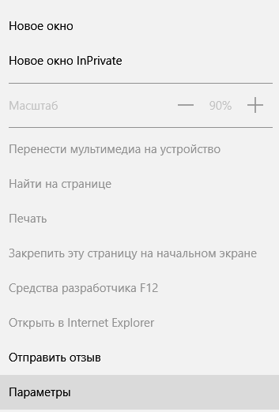
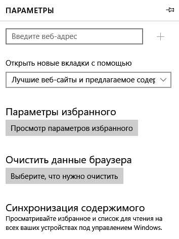
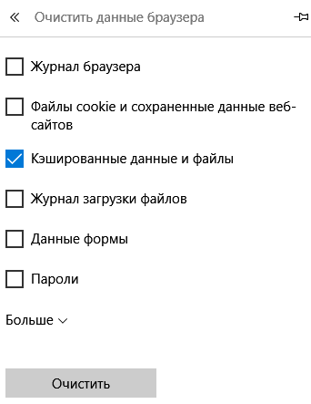

1. Нажмите на кнпоку "Дополнительно"  

2. Выберите Пункт "Параметры"  

3. Найдите заголовок "Очистить данные браузера" и Нажмите "Выберите, что нужно очистить"  

4. Установите флак напротив "Кэширование данные и файлов" и нажмите "Очистить"  
