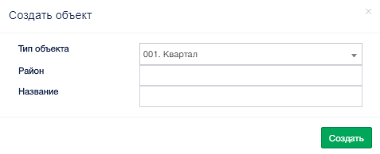
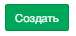
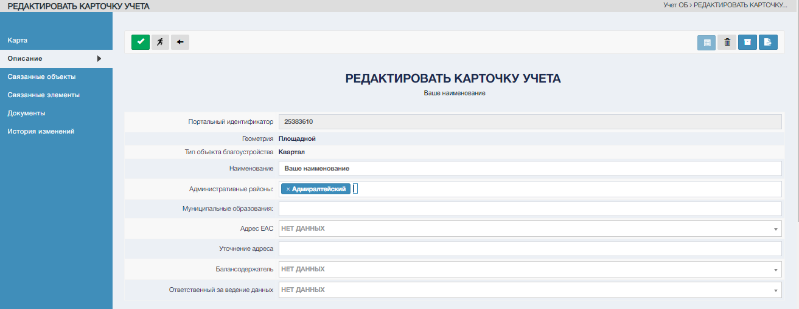

Воспользуйтесь управляющим элементом на панели управления раздела «Учет ОБ»  

Система откроет окно «Создать объект».  

После заполнения полей нажмите "Создать"  

Система откроет экранную форму «Карточка учета ОБ на редактирование»

По умолчанию заполнены характеристики, введенные в окне создания объекта

Операция внесения изменений в карточку учета ОБ описана в «Редактирование карточки учета ОБ».
