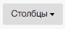
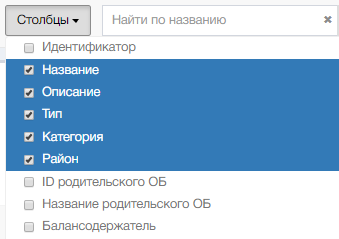

Набор столбцов определяется с помощью управляющего элемента «Столбцы» на панели инструментов  

Для отображения перечня столбцов нужно кликнуть по кнопке «Столбцы». Система откроет окно выбора столбцов

 Полный перечень столбцов реестра

| № п.п.    | Наименование столбца                         | Предназначение                                                 |
|-----------|----------------------------------------------|----------------------------------------------------------------|
| 1         | 3                                            | 4                                                              |
| 1.        | Портальный идентификатор.                    | Портальный уникальный номер объекта.                           |
| 2.        | Идентификатор.                               | Идентификатор.                                                 |
| 3.        | Название.                                    | Наименование объекта.                                          |
| 4.        | Описание.                                    | Описание ОБ.                                                   |
| 5.        | Тип.                                         | Тип ОБ по классификатору.                                      |
| 6.        | Категория.                                   | Категория ОБ по классификатору.                                |
| 7.        | Район.                                       | Район местонахождения ОБ.                                      |
| 8.        | Балансодержатель.                            | Балансодержатель ОБ.                                           |
| 9.        | Ответственный за ведение данных.             | Имя пользователя на Портале, ответственного за ведение данных. |
| 10.       | Контракт.                                    | Номера контрактов, заключенных на ОБ.                          |
| 11.       | Обслуж. орг-я.                               | Наименование организации, обслуживающей ОБ.                    |
| 12.       | ИОГВ\МО.                                     | ИОГВ\МО.                                                       |
| 13.       | Создан.                                      | ФИО создателя ОБ.                                              |
| 14.       | Изменен.                                     | ФИО пользователя, внесшего изменения в характеристики ОБ.      |
| 15.       | Дата создания.                               | Дата создания ОБ.                                              |
| 16.       | Дата изменения.                              | Дата изменения ОБ.                                             |
| 17.       | Адрес.                                       | Адрес ОБ.                                                      |
| 18.       | Площадь.                                     | Площадь ОБ.                                                    |
| 19.       | Протяженность.                               | Протяженность ОБ.                                              |
| 20.       | Инвентарный номер.                           | Инвентарный номер ОБ.                                          |
| 21.       | Дата инвентаризации.                         | Дата инвентаризации ОБ.                                        |
| 22.       | Наличие данных в ПК Имущество.               | Информации о наличии данных об ОБв система ПК Имущество.       |
| 23.       | Инвентарный номер в ПК Имущество.            | Инвентарный номер ОБ в системе ПК Имущество.                   |
| 24.       | Наличие охранного статуса.                   | Наличие охранного статуса ОБ.                                  |
| 25.       | Свойство связи геометрии дорог с семантикой. | Свойство связи геометрии дорогс семантикой.                    |
| 26.       | Номер базисного квартала.                    | Номер базисного квартала.                                      |
| 27.       | Кадастровый номер.                           | Кадастровый номер ОБ.                                          |
| 28.       | Уникальный идентификатор геометрии.          | Уникальный идентификатор геометрии ОБ.                         |
| 29.       | Верхний родительский объект.                 | Верхний родительский объект.                                   |
| 30.       | Номер по НПА.                                | Номер ОБ по НПА.                                               |
| 31.       | Тип геометрии.                               | Тип геометрии ОБ.                                              |
| 32.       | Старый номер.                                | Старый номер ОБ.                                               |
| 33.       | Площадь по карте.                            | Площадь ОБ по карте.                                           |
| 34.       | Протяженность по карте.                      | Протяженность ОБ по карте.                                     |
| 35.       | Источник данных.                             | Источник данных.                                               |
| 36.       | Наличие геометрии.                           | Наличие геометрии ОБ.                                          |

Необходимо выбрать нужные столбцы из представленного перечня, Система добавит выбранные столбцы в таблицу.